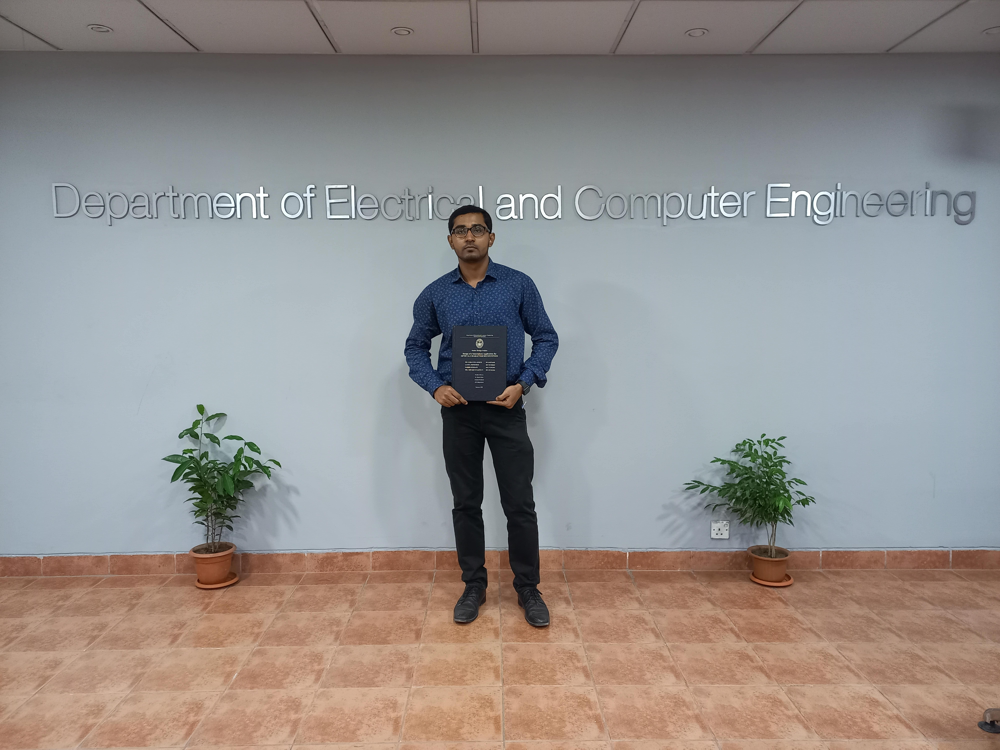

### 👋 Hi there , My name is Sabbir Hossain.
#### I am Web Application Developer.

 
 

  
  

## About Me
👋 A Laravel enthusiast with a flair for web development. As a dedicated learner and explorer, on a journey to master the art of crafting robust and elegant applications using the Laravel framework.

🚀 Armed with a solid foundation in computer science, I dive into the world of PHP and Laravel to build efficient, scalable, and user-friendly solutions. My code is not just about functionality; it's about creating an experience.

💻 In my coding adventures, I embrace clean code practices, explore the latest web technologies, and strive for continuous improvement. 

🌐 Beyond coding, I enjoy staying connected with the tech community, sharing insights, and learning from fellow developers. If you share a passion for Laravel, web development, or anything tech-related, let's connect and make the web a better place together!

📫 Reach out to me if you have exciting projects, collaboration opportunities, or just want to geek out about Laravel and web development. Happy coding! 🚀

## Use To Code

## Education

- Bachelor of Science in Computer Science and Engineering
  - North South University
  - Year: 2017-2022
  
## Certifications

- Google: [The Bits and Bytes of Computer Networking](https://www.coursera.org/account/accomplishments/certificate/YUJY99WZMFLJ)
- Google: [Technical Support Fundamentals](https://www.coursera.org/account/accomplishments/certificate/5E2MPTYNDBX8)
- Udemy:  [JavaScript, Bootstrap, PHP - Certification Course for Beginners](https://youaccel.com/admin/certificate_gen/tcpdf/ya/certificate_ya2.php?certid=34292345)
- Ostad:  [Web Development with PHP and Laravel]()
- Udemy: [Master Git and Github- Beginner to Expert]()

## Hobby
- PC Building and Customization
- Movie/TV series
- Video Game
- Travelling 

